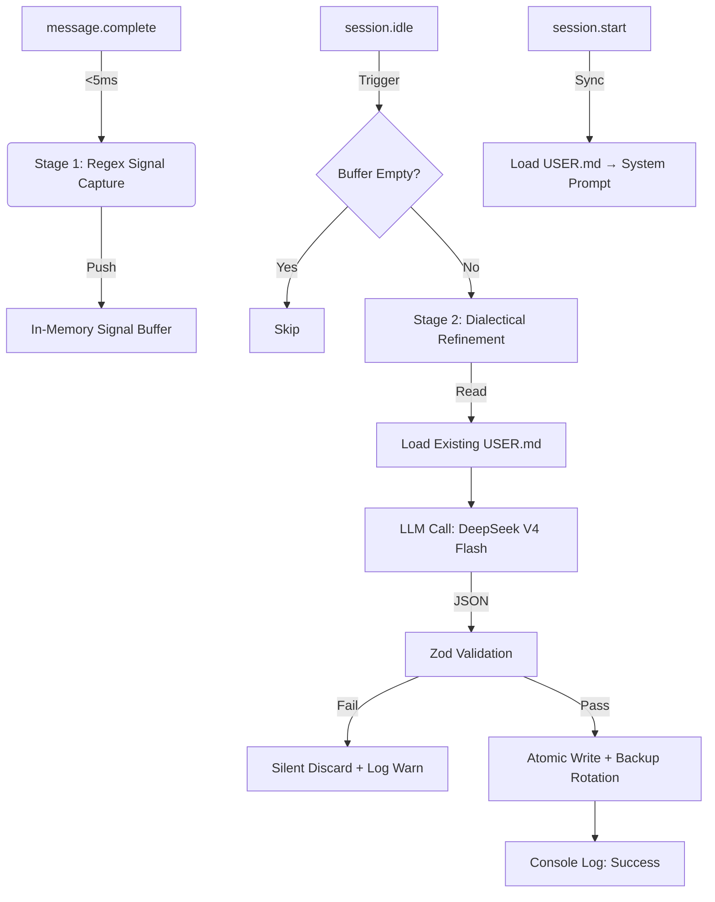

# opencode-memx PRD (Muse) v2.1

> **文档性质**: 最终开发规格说明书 / README 核心素材库
> **版本**: v2.1 (Silent Autonomy + Defensive Engineering)
> **最后更新**: 2026-07-30
> **状态**: Ready for Implementation

## 0. 执行摘要 (Executive Summary)

`opencode-memx` 是一个专为 OpenCode V2 设计的**零交互用户风格记忆插件**。它通过异步辩证推理，从对话历史中自动提炼跨项目长期偏好，并以结构化 Markdown 形式静默持久化。

**核心变更声明**：
-   ✅ **全面移除 TUI 确认流程**：采用 "Trust-by-Design" 模型，写入全程零阻塞。
-   ✅ **显式模型配置支持**：默认使用 DeepSeek V4 Flash，支持用户自定义覆盖。
-   ✅ **防御性静默写入**：通过原子写入 + 5版本备份轮转 + Zod 强校验替代人工审核。
-   ✅ **社区智慧移植**：深度融合 Honcho (辩证Prompt)、Claude Code (200行规范)、Mem0 (语义去重) 的核心实现。

---

## 1. 设计哲学与灵感溯源

### 1.1 为什么选择“静默自治”而非“人机确认”？

在 v1.0 设计中，我们曾计划引入 `$.ui.confirm()`。但在深入分析 Claude Code 和 Honcho 的实际运行数据后，我们发现：
-   **确认疲劳 (Confirmation Fatigue)**：用户偏好的形成是高频、微小的。每次写入都弹窗会导致用户在 3 次之后开始无脑按 Enter，确认机制形同虚设。
-   **心流破坏 (Flow Interruption)**：`session.idle` 本意是利用空闲时间，若因确认而阻塞，反而将后台任务变成了前台干扰。
-   **编辑即确认 (Edit-as-Confirmation)**：对于开发者而言，直接编辑 `USER.md` 比在 TUI 中选择 "Yes/No/Edit" 更符合肌肉记忆。文件本身就是最好的 UI。

### 1.2 开源实现移植矩阵 (Implementation Matrix)

| 参考项目 | 核心资产 | 在本插件中的具体落地 (TypeScript/Prompt) | 避坑指南 |
| :--- | :--- | :--- | :--- |
| **Honcho** | Dialectical Reasoning Prompt | `REFINEMENT_SYSTEM_PROMPT` 中强制要求 LLM 执行 "Cross-Project Applicability Test" | 不要照搬其 Python API 结构，只提取 Prompt 文本和 JSON Schema |
| **Claude Code** | 200-Line Hard Limit + Deprecation Syntax | `USER.md` 解析器硬编码上限；废弃条目使用 `~~[date] content~~` 格式 | 不要模仿其自由文本追加，必须坚持四分类 Schema |
| **Mem0** | Semantic Deduplication Logic | Refinement Prompt 输出 `action: "append" \| "update" \| "deprecate"` | MVP 阶段不调用 Mem0 SDK，仅复用其去重 Prompt 逻辑 |
| **OpenClaw** | Time Decay Metadata | 每条记录前缀 `[YYYY-MM-DD]`；预留 `last_accessed` 字段供未来排序 | 暂不实现衰减公式，避免过早优化 |

---

## 2. 核心架构与数据流

### 2.1 双阶段异步管道



### 2.2 模型配置与 Fallback 链

插件支持通过 `opencode.jsonc` 显式指定提炼模型，运行时遵循以下优先级：

```typescript
// src/config.ts
const MODEL_FALLBACK_CHAIN = [
  pluginConfig.refinementModel,      // 1. 用户显式配置 (如 "deepseek/deepseek-chat-v4-flash")
  "deepseek/deepseek-chat-v4-flash", // 2. 插件推荐默认值
  $.llm.getDefaultModel(),           // 3. OpenCode 全局默认模型
];

// 运行时解析逻辑
async function resolveRefinementModel(): Promise<string> {
  for (const modelId of MODEL_FALLBACK_CHAIN) {
    if (!modelId) continue;
    const available = await $.llm.getAvailableModels();
    if (available.includes(modelId)) return modelId;
    console.warn(`[memx] Model "${modelId}" not available, trying next fallback...`);
  }
  throw new Error("[memx] No valid refinement model found in fallback chain");
}
```

> ⚠️ **Provider 消歧义**: 若用户配置 `"deepseek-chat-v4-flash"` 但未指定 provider，插件应尝试匹配所有已安装 provider 中包含该字符串的模型 ID，并在日志中提示完整 ID。

---

## 3. LLM 提炼引擎规范

### 3.1 System Prompt (移植自 Honcho + Mem0)

```typescript
// src/prompts.ts
export const REFINEMENT_SYSTEM_PROMPT = `你是一个严谨的用户风格分析师。你的任务是从对话信号中提炼【跨项目、长期稳定】的用户偏好。

## 核心原则 (Dialectical Reasoning)
在决定保留任何信号前，必须依次自问：
1. 这条偏好是否仅适用于当前特定任务？(如是 → 丢弃)
2. 这条偏好是否与已有 USER.md 内容语义重复？(如是 → action: "update")
3. 这条偏好是否推翻了已有条目？(如是 → action: "deprecate" 旧条目 + action: "append" 新条目)
4. 这条偏好在用户未来的其他项目中是否仍然有效？(如不确定 → 丢弃)

## 输出格式 (Strict JSON)
{
  "actions": [
    {
      "type": "append" | "update" | "deprecate",
      "category": "Communication" | "Coding" | "Reasoning" | "Tooling",
      "content": "精炼后的偏好描述（中文，≤30字）",
      "targetIndex": number | null // update/deprecate 时指定目标条目索引
    }
  ],
  "reasoning": "简要说明辩证思考过程（≤100字）"
}

## 约束
- 绝不输出 markdown 代码块包裹的 JSON
- 绝不编造未在信号中出现的内容
- 若所有信号均不符合长期偏好标准，返回 {"actions": [], "reasoning": "..."}`;
```

### 3.2 Zod Schema & Runtime Validation

```typescript
// src/schema.ts
import { z } from "zod";

export const refinementResponseSchema = z.object({
  actions: z.array(z.object({
    type: z.enum(["append", "update", "deprecate"]),
    category: z.enum(["Communication", "Coding", "Reasoning", "Tooling"]),
    content: z.string().max(50),
    targetIndex: z.number().int().nonnegative().nullable(),
  })).max(5), // 单次提炼最多5条变更，防止 LLM 失控
  reasoning: z.string().max(200),
});

export type RefinementResponse = z.infer<typeof refinementResponseSchema>;
```

---

## 4. USER.md 存储规范与安全网

### 4.1 文件格式契约

```markdown
# User Style Profile
> Auto-generated by opencode-memx. Edit directly if needed.
> Last updated: 2026-07-30T09:45:00+08:00

## Communication
- [2026-07-28] 回答先给结论再展开推导
- [2026-07-25] 代码注释使用中文

## Coding
- [2026-07-30] TypeScript 优先使用 interface 而非 type
- ~~[2026-06-15] Vue 3 Composition API~~ (deprecated: migrated to Svelte)

## Reasoning
- [2026-07-29] 复杂问题先列分析框架再填充细节

## Tooling
- [2026-07-27] Git commit message 使用 Conventional Commits 格式
```

### 4.2 防御性写入机制 (Defensive Write Protocol)

由于取消了人工确认，以下三层防护**必须全部实现**：

#### Layer 1: 原子写入 + 备份轮转
```typescript
// src/user-md.ts
async function atomicWrite(content: string): Promise<void> {
  const filePath = path.join(os.homedir(), ".opencode", "USER.md");
  const backupDir = path.join(os.homedir(), ".opencode", ".memx-backups");

  // 1. 确保备份目录存在
  await fs.mkdir(backupDir, { recursive: true });

  // 2. 生成带时间戳的备份文件名
  const timestamp = new Date().toISOString().replace(/[:.]/g, "-");
  const backupPath = path.join(backupDir, `USER.md.bak.${timestamp}`);

  // 3. 复制当前文件到备份（若存在）
  if (await fs.exists(filePath)) {
    await fs.copyFile(filePath, backupPath);
  }

  // 4. 写入临时文件 → rename 原子替换
  const tmpPath = `${filePath}.tmp`;
  await fs.writeFile(tmpPath, content, "utf-8");
  await fs.rename(tmpPath, filePath);

  // 5. 备份轮转：保留最近5个，删除更旧的
  const backups = (await fs.readdir(backupDir))
    .filter(f => f.startsWith("USER.md.bak."))
    .sort()
    .reverse();
  for (const oldBackup of backups.slice(5)) {
    await fs.unlink(path.join(backupDir, oldBackup));
  }
}
```

#### Layer 2: 200行压缩触发器
-   每次写入后检查 `USER.md` 有效行数（排除空行和标题）
-   若 ≥ 180 行：触发 LLM 压缩调用（合并同类项 + 清除 deprecated）
-   压缩后再次执行 Layer 1 备份
-   压缩 Prompt 明确要求："保持四分类结构，优先保留近期条目，合并语义重复项"

#### Layer 3: 异常静默降级
-   Zod 校验失败 → `console.warn('[memx] Refinement output invalid, discarded')` + 保留 buffer 下次重试
-   文件写入失败 → `console.error('[memx] Write failed, buffer preserved')` + 不抛出异常
-   LLM 调用超时/报错 → `console.warn('[memx] LLM call failed, will retry next idle')` + 指数退避

---

## 5. 可观测性与调试

### 5.1 分级日志标准

| Level | Prefix | 触发场景 | 示例 |
| :--- | :--- | :--- | :--- |
| INFO | `[memx]` | 正常写入成功 | `[memx] Updated USER.md: 2 items appended` |
| WARN | `[memx:warn]` | 非致命异常 | `[memx:warn] Zod validation failed, discarded` |
| ERROR | `[memx:error]` | 需关注的故障 | `[memx:error] Backup rotation failed: EACCES` |
| DEBUG | `[memx:debug]` | 仅 debug 模式输出 | `[memx:debug] Buffer size: 3, signals: [...]` |

### 5.2 手动调试入口

提供 `reflect` tool 用于即时触发提炼，绕过 idle 等待：
```typescript
// src/tools.ts
export const reflectTool = {
  name: "reflect",
  description: "Manually trigger user style refinement from current session buffer",
  parameters: z.object({}),
  execute: async () => {
    const result = await runRefinementPipeline();
    return result.success
      ? `✅ Refined ${result.count} items. Check ~/.opencode/USER.md`
      : `❌ Refinement failed: ${result.error}`;
  },
};
```

---

## 6. 演进路线图

| Phase | Trigger | Capability | Reference |
| :--- | :--- | :--- | :--- |
| **MVP (v1.0)** | Now | Regex + Dialectical Refinement + Silent Write + Backup | Honcho + Claude Code |
| **v1.1** | USER.md > 50 items | Semantic Dedup via LLM (no external dep) | Mem0 Prompt Logic |
| **v1.2** | USER.md > 100 items | Time Decay Sorting + Top-K Injection | OpenClaw Formula |
| **v2.0** | Community Demand | Optional Vector Search via mem0ai SDK | Mem0 TS SDK |

---

## 7. 给 AI 编码助手的执行指令

> **⚡ CRITICAL INSTRUCTIONS FOR CODE GENERATION**
> 1.  **DO NOT** implement any TUI confirmation (`$.ui.confirm`, `$.ui.select`, etc.)
> 2.  **DO NOT** use external dependencies (mem0ai, transformers.js, etc.) in MVP
> 3.  **MUST** implement atomic write with `.tmp` + `rename` pattern
> 4.  **MUST** implement 5-version backup rotation in `~/.opencode/.memx-backups/`
> 5.  **MUST** support `refinementModel` config with fallback chain as defined in §2.2
> 6.  **MUST** use Zod runtime validation on ALL LLM outputs
> 7.  **MUST** follow the exact USER.md format in §4.1 including deprecation syntax
> 8.  **PREFER** DeepSeek V4 Flash as default refinement model
> 9.  **LOG** all operations using the level system in §5.1
> 10. **TEST** backup rotation and atomic write with unit tests before considering MVP complete

---

这份 `muse.md` 现在可以直接作为 AI 编码的唯一输入源。它消除了所有模糊地带，将“静默自治”的设计意图转化为了可验证的工程约束。建议将此文件保存在项目根目录，并在每次启动编码会话时作为上下文注入。
